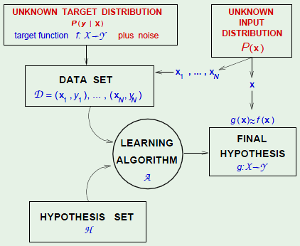

Introduction to Machine Learning in R and Python
========================================================
author: 
date: 
autosize: true
runtime: shiny
output: ioslides_presentation

What is Machine Learning
========================================================

**Statistics is 100 years old, so what is new here?**

Think of the data as being generated by a black box!

* Leo Breiman Proposed the "Two Cultures" in 2001
  + Generative Modelling - Seeks to develop stochastic models which fit data, and then make inferences about the data-generating mechanism based on the structure of the model. 
  + Predictive Modelling - prioritizes "Prediction". They are effectively silent about the underlying mechanism of generating the data. 

TODO: Typical Example of what ML can do


Supervised Machine Learning - Intuition
========================================================

 
 
***
We want to discover a function that describes the relationship between my Y and X. 
 
__But there are infinitely many functions that I can select!!__

We can siplify the process by "Hyperparameters" and "Parameters". HPs are designed whereas Parameters are __Learned__.

Supervised Machine Learning - Linear Models
========================================================
```{r, echo = FALSE}
shiny::numericInput("rows", "How many cars?", 5)

shiny::renderTable({
  head(cars, input$rows)
})
```

TODO: Basic Intuition 
TODO: Linear Models
TODO: Cost Function
TODO: Optimization 
TODO: Codes in Python and R to model one cost function and do one optimization


Bias and Variance
========================================================

TODO: Idea of bias and variance 
TODO: Model selection 
TODO: Feature selection
TODO: Regularization / Lasso and Ridge Regression 

Trees
========================================================

TODO: A sample tree model with pruning

Bagging
========================================================


Boosting
========================================================


Un-Supervised Learning 
========================================================


TODO: why is this required

Clustering
========================================================

TODO: K-Means
TODO: H Clust
TODO: PCA

